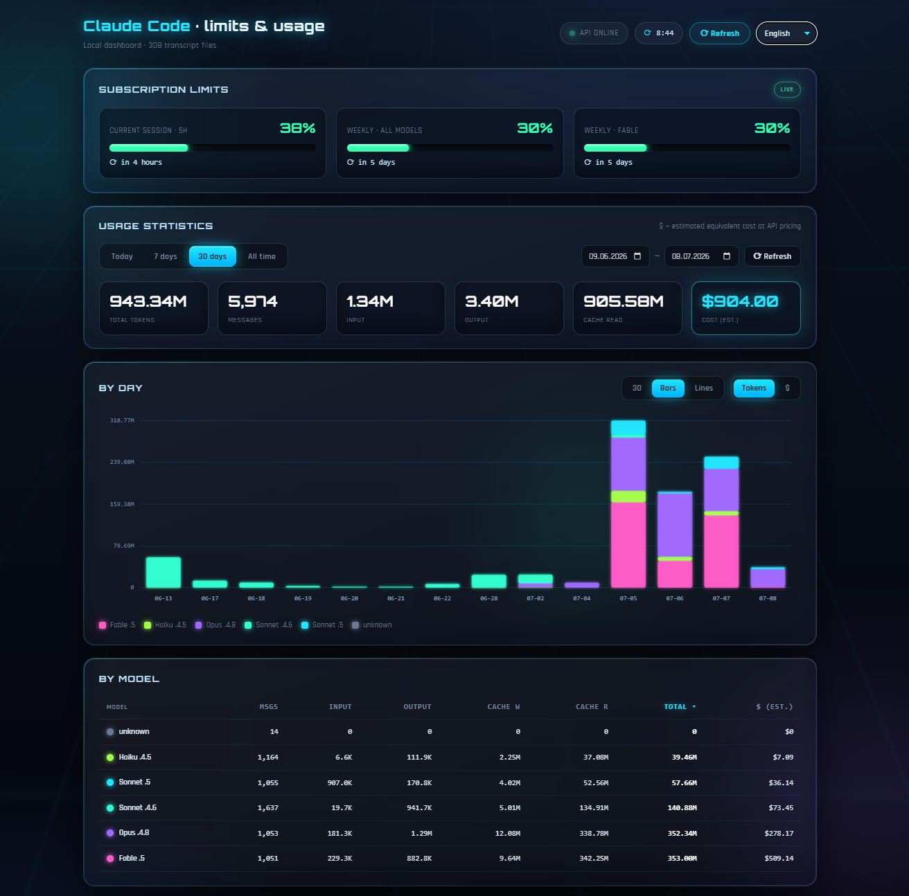

# Claude Code — лимиты и статистика

**Русский** · [English](README.en.md)

[](https://github.com/boryan54/claude-limit-dashboard/actions/workflows/ci.yml)
[](LICENSE)


Локальный веб-дашборд: живые лимиты подписки Claude Code и историческая статистика
использования по моделям и проектам, с оценкой стоимости и 3D/2D-графиками.



Данные берутся **только локально** и никуда не отправляются:

- **Лимиты** — эндпоинт `https://api.anthropic.com/api/oauth/usage` (OAuth-токен из
  `~/.claude/.credentials.json`), с fallback на кэш statusline.
- **Статистика** — транскрипты `~/.claude/projects/**/*.jsonl` (токены по моделям,
  проектам и дням; дедупликация по `message.id + requestId`).

## Возможности

- Живые лимиты (сессия 5 ч, недельные, scoped по моделям) с прогресс-барами и временем сброса.
- Статистика за период: пресеты + произвольный диапазон дат.
- Итоги (токены / сообщения / оценка стоимости $) и разбивка по моделям и проектам.
- График «По дням» с переключением видов: **3D** (WebGL/three.js, статичный), **Столбцы**, **Линии**.
- Автообновление статистики каждые 10 минут с обратным таймером и кнопкой ручного обновления.
- Интерфейс на 5 языках: русский (по умолчанию), английский, немецкий, французский, китайский.
- Футуристичный интерфейс: объёмное стекло, неоновая подсветка.

## Запуск

```bash
npm install
npm run dev      # http://localhost:5174 (Vite как middleware внутри Express, HMR)
```

Прод (единый порт):

```bash
npm run build && npm start   # http://localhost:5174
```

## Стек

Node.js + Express (API и раздача фронтенда на одном порту) · Vite + React · three.js.

Стоимость в $ — **оценка эквивалентной стоимости по API-прайсу** (на подписке реальные
лимиты измеряются в процентах, а не в деньгах).

## Лицензия

[MIT](LICENSE) © 2026 Boris Kupryakov
